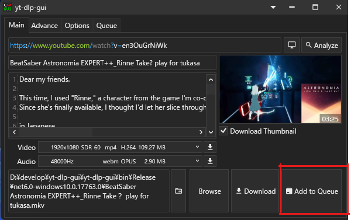
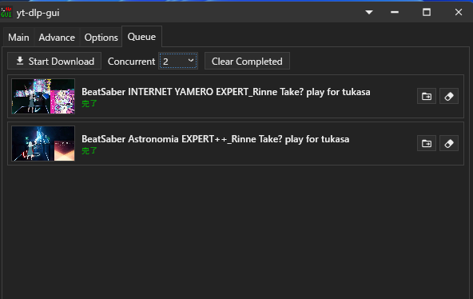
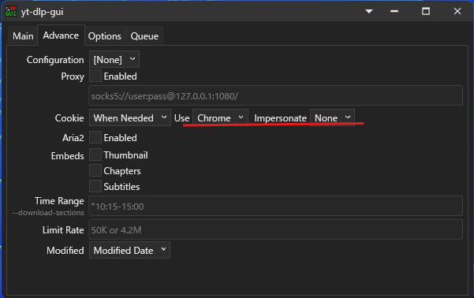

# yt-dlp-gui-custom

Fork of [yt-dlp-gui](https://github.com/kannagi0303/yt-dlp-gui) by かんなぎ (Kannagi)

* Front-end of [yt-dlp](https://github.com/yt-dlp/yt-dlp) (and Compatible Applications)
* Windows Only (10 or above)

---

## English

### Additional Features (Custom)

#### Download Queue

Add multiple videos to queue and download in parallel.

1. Analyze a video URL
2. Click **Add to Queue** button to add to download queue

3. Go to **Queue** tab to manage downloads
4. Set **Concurrent** to control parallel download count (1-3)
5. Click **Start Download** to begin

#### Bot Detection Bypass

Use browser impersonation to bypass bot detection (useful for sites like YouTube).

1. Go to **Advance** tab
2. Set **Impersonate** to Chrome, Edge, Firefox, or Safari

### Features (Original)
* Easy-to-use
* Portable
* Selectable video quality
* Download single chapter
* Download single stream
* Cookie supported
* Configuration supported
* External Downloader supported (Aria2)
* Localized Language supported

### Requirements
* All required components (yt-dlp, FFMPEG) are included in the release package

### Credits
* Original Author: [かんなぎ (Kannagi)](https://github.com/kannagi0303)
* Original Repository: [yt-dlp-gui](https://github.com/kannagi0303/yt-dlp-gui)

For original documentation, please refer to the [original wiki](https://github.com/kannagi0303/yt-dlp-gui/wiki).

### Troubleshooting

If you encounter any issues, please include the log file when reporting:

1. Log files are stored in the `logs/` folder (same location as the executable)
2. Log filename format: `yyyy-MM-dd-HHmmss.log` (e.g., `2024-01-15-143052.log`)
3. Logs are automatically rotated after 30 days
4. When creating an issue, attach the relevant log file to help us diagnose the problem

### Disclaimer
This tool is intended for legal purposes only. Mixed Nuts assumes no responsibility for any damages or issues arising from the use of this tool.

---

## 日本語

### 追加機能 (カスタム版)

#### ダウンロードキュー

複数の動画をキューに追加して並列ダウンロードできます。

1. 動画URLを分析
2. **Add to Queue** ボタンをクリックしてキューに追加

3. **Queue** タブでダウンロードを管理
4. **Concurrent** で同時ダウンロード数を設定 (1-3)
5. **Start Download** をクリックして開始

#### Bot検出回避

ブラウザ偽装でBot検出を回避できます（YouTubeなどで有効）。

1. **Advance** タブを開く
2. **Impersonate** でChrome、Edge、Firefox、Safariのいずれかを選択

### 機能 (オリジナル版)
* シンプルで使いやすい
* ポータブル（インストール不要）
* 動画品質の選択が可能
* 単一チャプターのダウンロード
* 単一ストリームのダウンロード
* Cookie対応
* 設定ファイル対応
* 外部ダウンローダー対応 (Aria2)
* 多言語対応

### 必要なもの
* 必要なコンポーネント (yt-dlp, FFMPEG) はリリースパッケージに同梱されています

### クレジット
* オリジナル作者: [かんなぎ (Kannagi)](https://github.com/kannagi0303)
* オリジナルリポジトリ: [yt-dlp-gui](https://github.com/kannagi0303/yt-dlp-gui)

詳細なドキュメントは[オリジナルのwiki](https://github.com/kannagi0303/yt-dlp-gui/wiki)を参照してください。

### トラブルシューティング

問題が発生した場合は、Issueにログファイルを添付してください:

1. ログファイルは `logs/` フォルダに保存されます（実行ファイルと同じ場所）
2. ログファイル名の形式: `yyyy-MM-dd-HHmmss.log`（例: `2024-01-15-143052.log`）
3. ログは30日後に自動的にローテーションされます
4. Issueを作成する際は、該当するログファイルを添付してください

### 免責事項
本ツールは合法的な目的でのみ使用してください。本ツールで生じた損害等に関してMixed Nutsでは一切責任を負いません。
